# Nosved Player (Nosved Player)


[](https://github.com/DevSon1024/Nosved-Player/releases)


Nosved Player is a high-performance, native Android video player built with a focus on absolute playback smoothness, clean aesthetics, and extensive user customization.

---

Originally built as an ExoPlayer-based application, Nosved Player has been completely re-engineered under the hood to utilize the **mpv-android** engine. This architectural shift merges our minimalist Material Design UI with the raw decoding power of MPV, delivering unmatched format compatibility, hardware acceleration, and seamless video handling.

> ## Why MPV?

The transition from ExoPlayer to `is.xyz.mpv` allows Nosved Player to offer a truly desktop-class media experience on mobile. It brings native hardware decoding (`mediacodec`), superior subtitle rendering, and real-time color enhancement capabilities without sacrificing battery life or UI responsiveness.

> ## Key Features

> ### Advanced Playback Engine

- **Dynamic Decoder Selection:** Instantly switch between Auto, Hardware (HW/HW+), and Software (SW) decoding on the fly.
- **Smart Audio Boost:** Amplify low-volume videos safely up to 200%.
- **Rich Subtitle Support:** Cycle tracks, adjust synchronization delays, customize fonts, and tweak scaling/offsets directly from the player.
- **Smart Enhance Mode:** Real-time hardware-level adjustments for Video Brightness, Contrast, Saturation, Gamma, and Hue.

> ### Clean, Native UI

- **Material Design 3:** fully integrated with Android's Dynamic Color palette.
- **AMOLED & Dark Themes:** True black modes for battery saving and comfortable nighttime viewing.
- **Unobtrusive Overlays:** Transparent navigation bars, auto-hiding controls, and configurable quick-action buttons.
- **Smooth Navigation:** Jetpack Compose-driven UI for a fluid, jank-free browsing experience.

> ### Deep Customization & Gestures

- **Multi-finger Gestures:** Configure 2-finger and 3-finger taps for rapid actions (Play/Pause, Fast Play, etc.).
- **Screen Edge Controls:** Slide to adjust brightness and volume, with customizable sensitivity.
- **Layout Editor:** Customize top and bottom control panels to fit your exact workflow.
- **Multiple Finger Gestures:** Configurable seek durations and tap-to-speed parameters.

---

## Screenshots

### Library & Media Management

|                                                        Smart Library                                                        |                                                          Video Explorer                                                          |                                                      Encrypted Vault                                                      |                                                       App Settings                                                       |
| :-------------------------------------------------------------------------------------------------------------------------: | :------------------------------------------------------------------------------------------------------------------------------: | :-----------------------------------------------------------------------------------------------------------------------: | :----------------------------------------------------------------------------------------------------------------------: |
| <a href="Screenshots/1_LibraryScreen.jpg">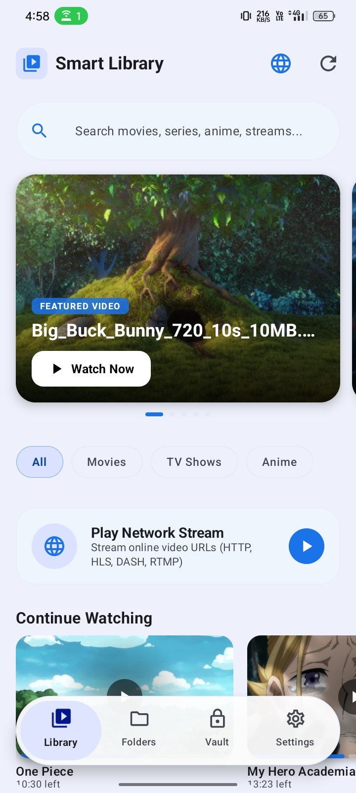</a> | <a href="Screenshots/2.VideoListScreen.jpg">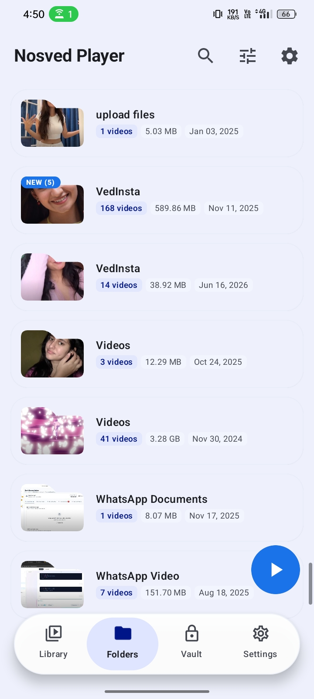</a> | <a href="Screenshots/3_VaultScreen.jpg">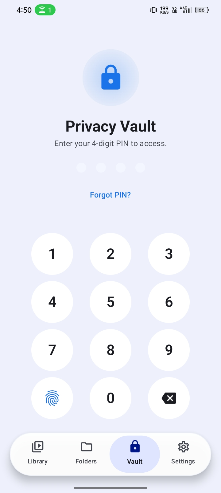</a> | <a href="Screenshots/4_SettingsScreen.jpg">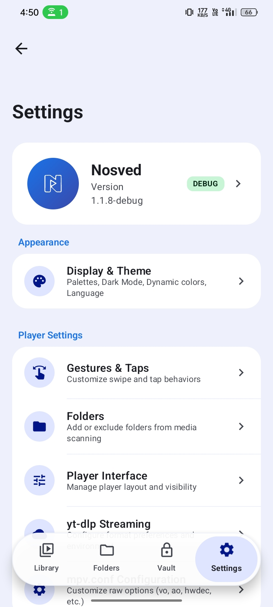</a> |

|                                                     Online Feed                                                     |                                                                           Layout Customizer                                                                           |                                                           Storage Analyzer                                                           |                                                                        Media Inspector                                                                        |
| :-----------------------------------------------------------------------------------------------------------------: | :-------------------------------------------------------------------------------------------------------------------------------------------------------------------: | :----------------------------------------------------------------------------------------------------------------------------------: | :-----------------------------------------------------------------------------------------------------------------------------------------------------------: |
| <a href="Screenshots/5_FeedScreen.jpg">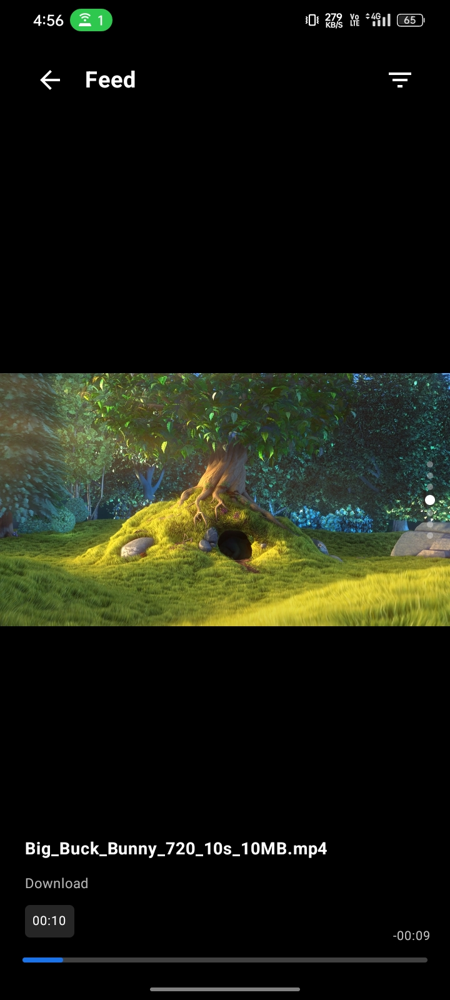</a> | <a href="Screenshots/9_PlayerScreenCustomizerScreen.jpg">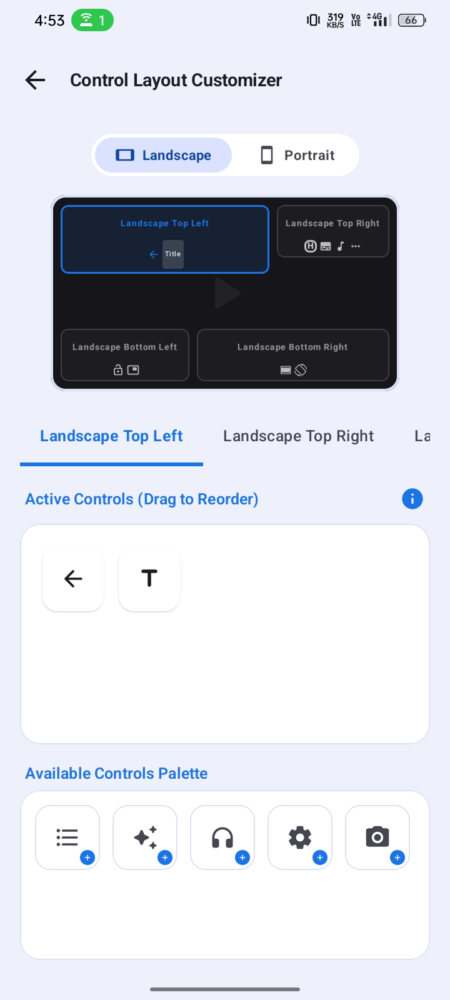</a> | <a href="Screenshots/10_StorageAnalyzer.jpg">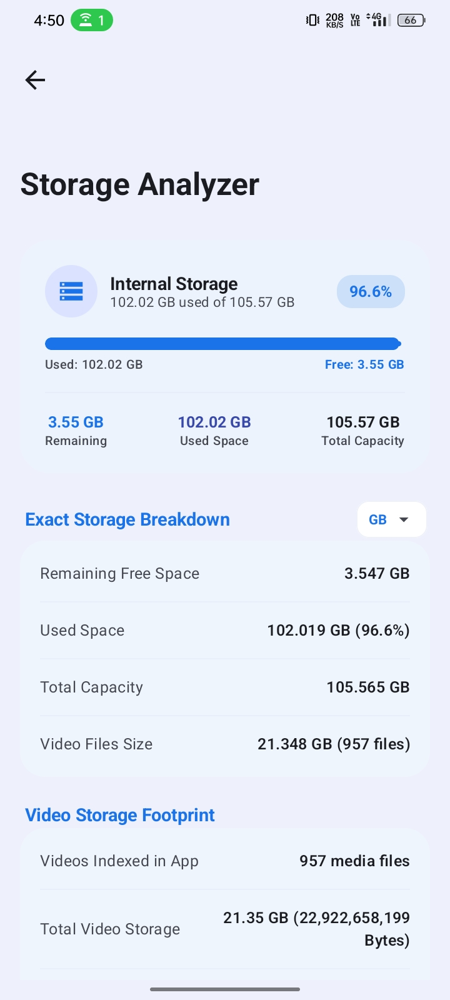</a> | <a href="Screenshots/11_MediaInformationBottomSheet.jpg">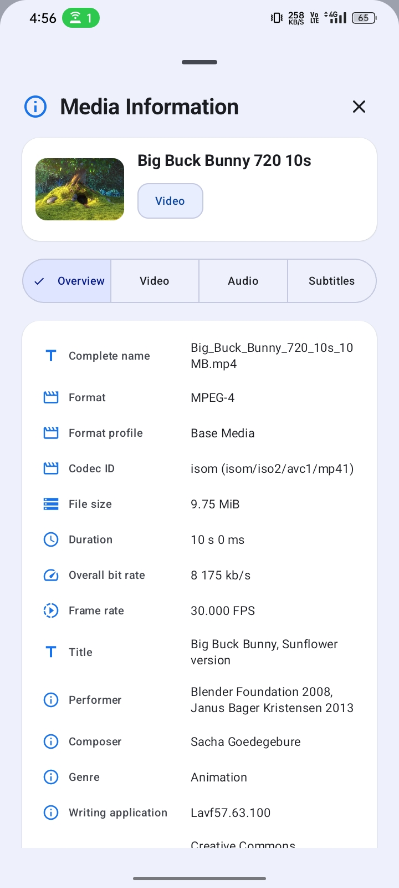</a> |

### Player & Playback Controls

<p align="center">
  <a href="Screenshots/6_PlayerScreen.jpg">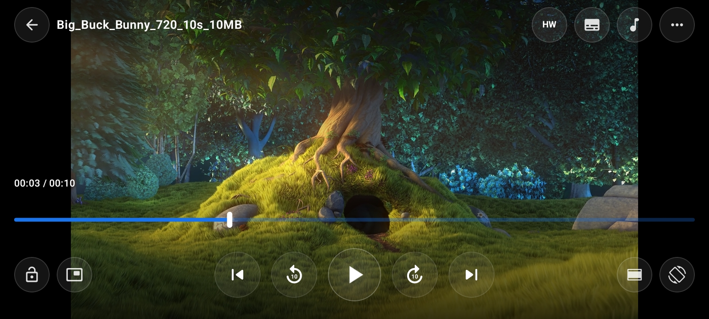</a>
  <br>
  <sub><b>High-Performance Playback Interface with Gesture & HW/SW Engine Controls</b></sub>
</p>

|                                                Up Next Queue                                                 |                                                      Quick Controls & Playback Speed                                                       |
| :----------------------------------------------------------------------------------------------------------: | :----------------------------------------------------------------------------------------------------------------------------------------: |
| <a href="Screenshots/7_Queue.jpg">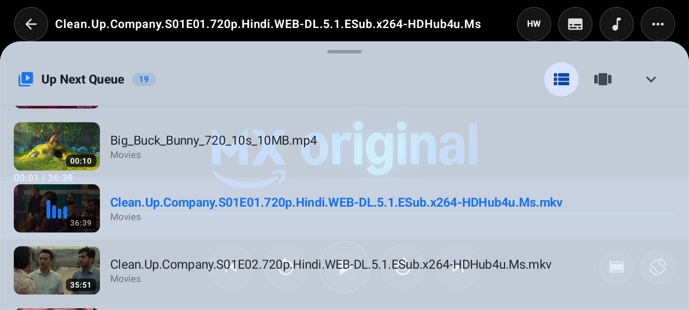</a> | <a href="Screenshots/8_MoreOptions.jpg">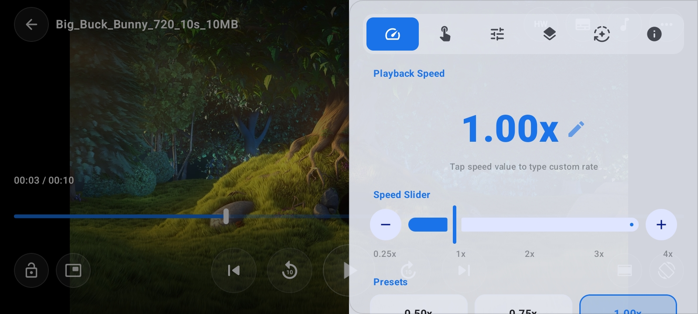</a> |

---

> ## Building the Project

> ### Prerequisites

- Android Studio (Latest Stable or Ladybug)
- JDK 17+
- Android SDK API 34+

> ### Clone & Build

```bash
git clone https://github.com/DevSon1024/Nosved-Player.git
cd Nosved-Player
./gradlew assembleRelease
```

## Acknowledgements

Special thanks to [**Ritesh Pandit (@Riteshp2001)**](https://github.com/Riteshp2001) and the [**mpvRx**](https://github.com/Riteshp2001/mpvRx) project for the inspiration and foundational work on:

- **yt-dlp Online Streaming Integration** - enabling seamless online video playback via yt-dlp within an MPV-based Android player.
- **MPV Config Editor** - the in-app mpv.conf editor concept that allows users to tweak the MPV engine directly from the UI.
- **Thumbnail Generation Integration** - the approach to generating and displaying video thumbnails within an MPV-backed player.

---

## Star History

<a href="https://www.star-history.com/?repos=Devson1024%2Fnosved-player&type=date&legend=top-left">
 <picture>
   <source media="(prefers-color-scheme: dark)" srcset="https://api.star-history.com/chart?repos=Devson1024/nosved-player&type=date&theme=dark&legend=top-left" />
   <source media="(prefers-color-scheme: light)" srcset="https://api.star-history.com/chart?repos=Devson1024/nosved-player&type=date&legend=top-left" />
   
 </picture>
</a>
